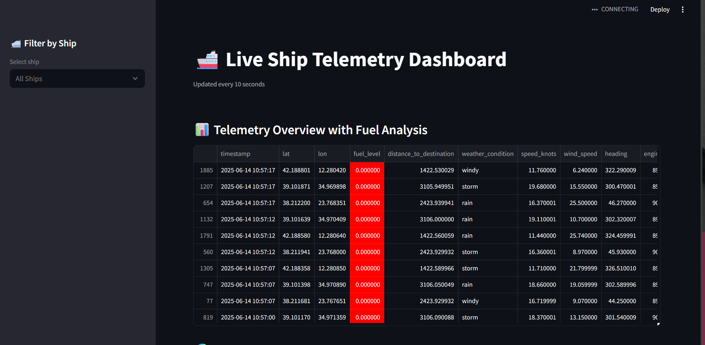
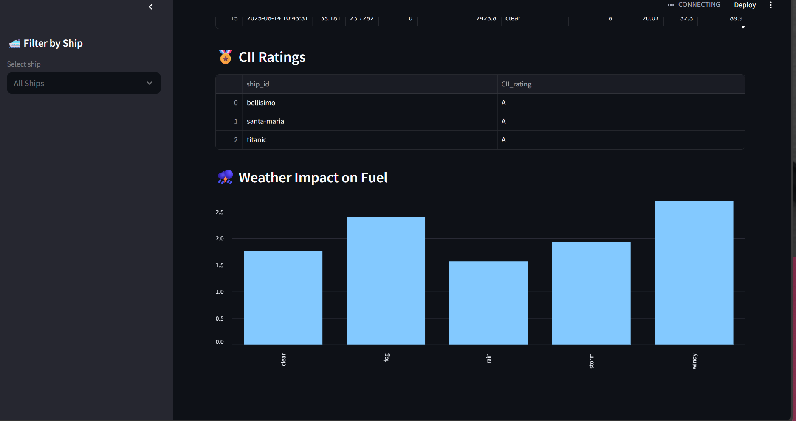
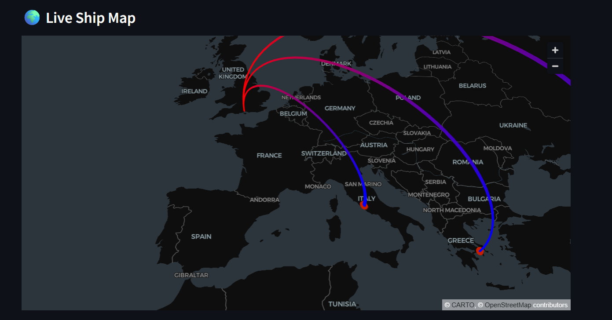

# 🚢 Ship Telemetry Monitoring System

A real-time telemetry monitoring platform for maritime vessels, built with **Apache Airflow 3.0.0**, **PySpark**, **Streamlit**, and **DuckDB**.

---

## 🧭 Overview

This system provides real-time monitoring and analytics for ship telemetry data, including:

- 🗺️ Location and movement tracking  
- ⛽ Fuel consumption monitoring  
- 🌦️ Weather condition tracking  
- ⚙️ Engine performance metrics  
- 🚨 Real-time alerts and notifications  

---

## 📊 Dashboard Preview

<p align="center">
  
  <br/>
  
  <br/>
  
</p>

---

## 🧱 Architecture

The system consists of three major components:

1. **Stream Processor** – PySpark pipeline processing telemetry in near real-time  
2. **Monitoring Dashboard** – Interactive insights via Streamlit  
3. **Orchestration Layer** – Apache Airflow manages scheduling and monitoring

---

## ⚙️ Tech Stack

| Layer             | Technology               |
|------------------|--------------------------|
| Orchestration     | Apache Airflow 3.0.0     |
| Stream Processing | PySpark                  |
| Data Storage      | DuckDB                   |
| Dashboard         | Streamlit                |
| Containerization  | Docker + Docker Compose  |

---

## 🚀 Getting Started

### 1. Clone the Repository

```bash
git clone https://github.com/mickyansLK/ship-telemetry-project.git
cd ship-telemetry-project

python -m venv venv
source venv/bin/activate  # On Windows: venv\Scripts\activate
pip install -r requirements.txt

AIRFLOW_HOME=$(pwd)
KAFKA_BOOTSTRAP_SERVERS=localhost:9092
KAFKA_TOPIC=ship_telemetry
EXPORT_PATH=warehouse/default
CHECKPOINT_PATH=checkpoints
DASHBOARD_REFRESH_INTERVAL=10
CACHE_TTL=30

export AIRFLOW_HOME=$(pwd)
airflow standalone

streamlit run dashboard.py

ship-telemetry-project/
├── dags/
│   └── ship_telemetry_dag.py        # Airflow DAG definition
├── stream_processor.py              # Real-time Spark processing
├── dashboard.py                     # Streamlit dashboard
├── simulate_sensors.py              # Data simulation logic
├── config.py                        # Environment configuration
├── requirements.txt                 # Project dependencies
├── airflow.cfg                      # Airflow configuration
└── assets/                          # Dashboard images

[core]
dags_folder = dags
load_examples = False

[api]
auth_backend = airflow.api.auth.backend.basic_auth
jwt_secret = your-secure-secret
port = 8080
workers = 4
host = 0.0.0.0

[webserver]
secret_key = your-webserver-secret
